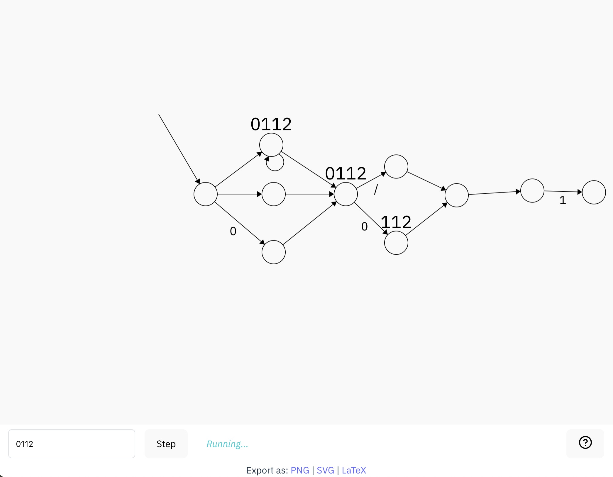

# NFA sandbox

A sandbox for creating, running, saving, and testing NFAs.

Deployed [here](https://github.shilangyu.dev/nfa-sandbox)

## Acknowledgments

This is a port of [Evan's fsm](https://github.com/evanw/fsm). Code has been modernized and annotated with types.
